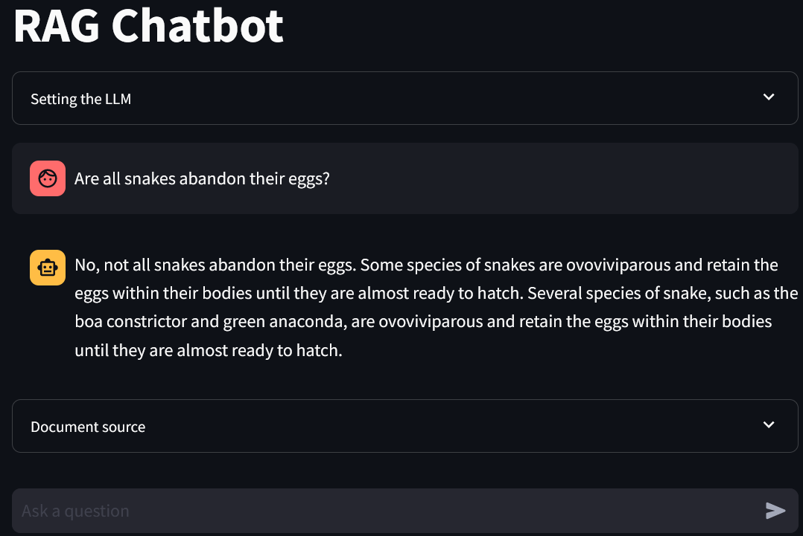

# LLM-RAG Chatbot
## Local LLM-powered RAG Chatbot with GPU Acceleration

ระบบ RAG (Retrieval-Augmented Generation) Chatbot ที่ใช้ Local LLM โดยไม่ต้องพึ่ง HuggingFace API หรือ Cloud services รองรับทั้ง Linux และ Windows พร้อม GPU acceleration

### ✨ Features
- 🤖 **Local LLM:** Llama 3.2 3B Instruct (ไม่ต้องอินเทอร์เน็ต)
- 🚀 **GPU Acceleration:** รองรับ NVIDIA CUDA
- 📚 **RAG System:** ตอบคำถามจากเอกสารที่อัปโหลด
- 🔍 **Vector Search:** FAISS vector database
- 💻 **Cross-platform:** Linux และ Windows
- 🌐 **Web Interface:** Streamlit GUI

# LLM-RAG Chatbot
## Local LLM-powered RAG Chatbot with GPU Acceleration

ระบบ RAG (Retrieval-Augmented Generation) Chatbot ที่ใช้ Local LLM โดยไม่ต้องพึ่ง HuggingFace API หรือ Cloud services รองรับทั้ง Linux และ Windows พร้อม GPU acceleration

### ✨ Features
- 🤖 **Local LLM:** Llama 3.2 3B Instruct (ไม่ต้องอินเทอร์เน็ต)
- 🚀 **GPU Acceleration:** รองรับ NVIDIA CUDA
- 📚 **RAG System:** ตอบคำถามจากเอกสารที่อัปโหลด
- 🔍 **Vector Search:** FAISS vector database
- 💻 **Cross-platform:** Linux และ Windows
- 🌐 **Web Interface:** Streamlit GUI

### 📊 Performance
- **GPU mode:** 25-35+ tokens/sec (RTX 2060)
- **CPU mode:** 8-12 tokens/sec

---

##  Project Structure
```
AI-LLM/
├── rag_chatbot.py              # Main Streamlit application
├── rag_chatbot_windows.py      # Windows-specific version
├── pages/                      # Streamlit pages
│   ├── document_embedding.py   # Document processing
│   └── backend/
│       └── rag_functions.py    # Core RAG logic
├── data/                       # 🆕 Data directory
│   ├── sources/                # Source documents (PDF, TXT)
│   └── embeddings/             # Vector stores (FAISS)
├── scripts/                    # 🆕 Utility scripts
│   ├── testing/                # Testing & validation scripts
│   │   ├── test_gpu.py         # GPU performance testing
│   │   ├── validate_gpu_setup.py # Setup validation
│   │   └── check_llama_cuda.py # CUDA compatibility check
│   └── utilities/              # Utility scripts
│       ├── build_faiss_index.py # Vector store builder
│       └── fix_faiss_compatibility.py # FAISS API fixes
├── docs/                       # 🆕 Documentation
│   ├── DOCUMENTATION_INDEX.md  # Documentation index
│   ├── QUICK_REFERENCE.md      # Quick reference guide
│   └── troubleshooting/        # Troubleshooting guides
│       ├── LLAMA_CPP_PYTHON_TROUBLESHOOTING.md
│       └── GPU_SETUP_UPDATES.md
├── setup/                      # Installation scripts
│   ├── linux/                  # Linux setup files
│   └── windows/                # Windows setup files
├── issue/                      # Troubleshooting scripts
│   └── setup_complete_gpu.bat  # GPU setup script
└── experiment/                 # Jupyter notebooks
    ├── LLM RAG experiment.ipynb
    └── Run_Streamlit_of_LLM_RAG.ipynb
```

---

## 🐧 Linux Installation

### One-Command Install:
```bash
cd LLM-RAG
setup/linux/auto_setup.sh && source ~/.bashrc && setup/linux/setup_python_env.sh && setup/linux/download_models.sh
```

### Step-by-Step:
```bash
cd LLM-RAG

# 1. Install system dependencies (CUDA, Python, etc.)
setup/linux/auto_setup.sh
source ~/.bashrc

# 2. Setup Python environment and packages
setup/linux/setup_python_env.sh

# 3. Download LLM models (~2.16 GB) to ~/Documents/AI/
setup/linux/download_models.sh

# 4. Run application
setup/linux/run_app.sh
```

**LLM path:** `~/Documents/AI/llm/Llama-3.2-3B-Instruct-GGUF/Llama-3.2-3B-Instruct-Q5_K_M.gguf`

### 📖 **Detailed Guide:** `setup/linux/SETUP_GUIDE.md`
### ⚡ **Quick Reference:** `setup/linux/QUICK_START.md`

---

## 🖥️ Windows Installation

### 🚀 Quick GPU Setup (แนะนำ):
```cmd
cd AI-LLM
.\issue\setup_complete_gpu.bat
```

### 🎯 Alternative Installation Menu:
```cmd
cd AI-LLM
.\issue\install_menu.bat
```

### Prerequisites:
1. **Python 3.11+** (from python.org)
2. **Git for Windows** (from git-scm.com)
3. **NVIDIA CUDA Toolkit 12.1** (for GPU support)
4. **Visual Studio Build Tools 2022** (for compiling C++ packages)

### Step-by-Step Manual Installation:
```cmd
cd AI-LLM

REM 1. Setup Python environment
setup\windows\setup_python_env_windows.bat

REM 2. Download LLM models (~2.16 GB) to C:\AI\
setup\windows\download_models_windows.bat

REM 3. Run application
setup\windows\run_app_windows.bat
```

**LLM path:** `C:\AI\llm\Llama-3.2-3B-Instruct-GGUF\Llama-3.2-3B-Instruct-Q5_K_M.gguf`

### 🔧 Testing & Validation:
```cmd
REM Test GPU performance
python scripts\testing\test_gpu.py

REM Validate installation
python scripts\testing\validate_gpu_setup.py

REM Check CUDA compatibility
python scripts\testing\check_llama_cuda.py
```

### 🛠️ Troubleshooting:
- **Documentation:** `docs\troubleshooting\`
- **Quick fixes:** `issue\diagnose_llama_cpp.bat`
- **GPU issues:** `docs\troubleshooting\GPU_SETUP_UPDATES.md`

### 📖 **Detailed Guide:** `setup/windows/WINDOWS_SETUP.md`
### ⚡ **Quick Reference:** `setup/windows/WINDOWS_QUICK_START.md`

---

## 🎯 Usage

1. **เปิด browser** ไปที่ `http://localhost:8501`
2. **กด "Create chatbot"** เพื่อโหลดโมเดล
3. **เลือก Vector Store** (naruto, snake, หรือ naruto_snake)
4. **เริ่มถามคำถาม!**

### Example Questions:
- "What is Naruto's main goal?" (ใช้ naruto vector store)
- "How do snakes shed their skin?" (ใช้ snake vector store)
- "Compare Naruto and snake characteristics" (ใช้ naruto_snake vector store)

### 📊 Performance Monitoring:
- **GPU working:** ดู log หา "offloaded 29/29 layers to GPU"
- **Speed > 25 tokens/sec:** GPU acceleration active
- **Speed ~10 tokens/sec:** CPU only

### 🔧 Utilities Available:
```cmd
REM Rebuild vector stores
python scripts\utilities\build_faiss_index.py

REM Fix FAISS compatibility issues  
python scripts\utilities\fix_faiss_compatibility.py
```

---

## 🔧 Troubleshooting

### Common Issues:

#### Linux:
```bash
# CUDA not working
export CUDA_HOME=/usr/local/cuda
export LD_LIBRARY_PATH=$CUDA_HOME/lib64:$LD_LIBRARY_PATH

# llama-cpp-python issues
pip uninstall llama-cpp-python
CMAKE_ARGS="-DLLAMA_CUBLAS=on" pip install llama-cpp-python --no-cache-dir
```

#### Windows:
```cmd
REM CUDA not detected
set CUDA_PATH=C:\Program Files\NVIDIA GPU Computing Toolkit\CUDA\v12.1
set PATH=%CUDA_PATH%\bin;%PATH%

REM PowerShell execution policy
powershell Set-ExecutionPolicy -ExecutionPolicy RemoteSigned -Scope CurrentUser
```

##  License

This project uses various open-source components:
- **Llama 3.2:** Meta's Llama 3.2 license
- **LangChain:** MIT License
- **Streamlit:** Apache License 2.0

---

## 🙏 Acknowledgments

- **Meta AI** for Llama 3.2 model
- **LangChain** for RAG framework
- **Streamlit** for web interface
- **llama.cpp** community for GGUF format and CUDA support

---

## 📞 Support

### Need Help?
1. **Read the documentation** in `docs/` directory
2. **Check troubleshooting guides** in `docs/troubleshooting/`
3. **Run validation scripts** in `scripts/testing/`
4. **Verify system requirements** are met

### Key Documentation:
- **Windows Setup:** `setup/windows/WINDOWS_SETUP.md`
- **Linux Setup:** `setup/linux/SETUP_GUIDE.md`
- **Quick Reference:** `docs/QUICK_REFERENCE.md`
- **GPU Troubleshooting:** `docs/troubleshooting/`

### 🧪 Testing & Validation:
- **GPU Test:** `python scripts/testing/test_gpu.py`
- **Full Validation:** `python scripts/testing/validate_gpu_setup.py`
- **CUDA Check:** `python scripts/testing/check_llama_cuda.py`

---

This repository demonstrates the development of Retrieval-Augmented Generation (RAG). 
RAG enables LLM to generate answer text based on custom documents.
This repo also presents the RAG as a chatbot in Streamlit app.

Below is the diagram of the development:


# Interface Display


## 📝 Related Article 
The article discussing the process of developing this application:

[RAG and Streamlit Chatbot: Chat with Documents Using LLM](https://www.analyticsvidhya.com/blog/2024/04/rag-and-streamlit-chatbot-chat-with-documents-using-llm/)
