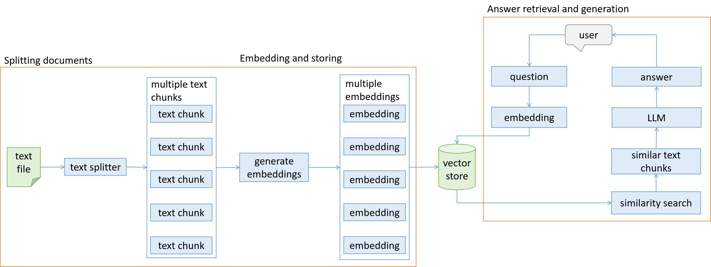

# LLM-RAG Chatbot
## Local LLM-powered RAG Chatbot with GPU Acceleration

ระบบ RAG (Retrieval-Augmented Generation) Chatbot ที่ใช้ Local LLM โดยไม่ต้องพึ่ง HuggingFace API หรือ Cloud services รองรับทั้ง Linux และ Windows พร้อม GPU acceleration

### ✨ Features
- 🤖 **Local LLM:** Llama 3.2 3B Instruct (ไม่ต้องอินเทอร์เน็ต)
- 🚀 **GPU Acceleration:** รองรับ NVIDIA CUDA
- 📚 **RAG System:** ตอบคำถามจากเอกสารที่อัปโหลด
- 🔍 **Vector Search:** FAISS vector database
- 💻 **Cross-platform:** Linux และ Windows
- 🌐 **Web Interface:** Streamlit GUI

### 📊 Performance
- **Linux + GPU:** ~4,000+ tokens/second
- **Windows + GPU:** ~3,800+ tokens/second
- **CPU only:** ~2,500-2,700 tokens/second

---

## 🚀 Quick Start

### 📁 Directory Structure
```
LLM-RAG/
├── rag_chatbot.py              # Main application
├── requirements.txt            # Dependencies
├── pages/backend/rag_functions.py  # Backend logic
├── vector store/               # Pre-built knowledge base
├── data sources/               # Source documents
└── setup/                      # 🆕 Installation scripts
    ├── linux/                  # Linux setup files
    └── windows/                # Windows setup files
```

---

## 🐧 Linux Installation

### One-Command Install:
```bash
cd LLM-RAG
setup/linux/auto_setup.sh && source ~/.bashrc && setup/linux/setup_python_env.sh && setup/linux/download_models.sh
```

### Step-by-Step:
```bash
cd LLM-RAG

# 1. Install system dependencies (CUDA, Python, etc.)
setup/linux/auto_setup.sh
source ~/.bashrc

# 2. Setup Python environment and packages
setup/linux/setup_python_env.sh

# 3. Download LLM models (~2.16 GB) to ~/Documents/AI/
setup/linux/download_models.sh

# 4. Run application
setup/linux/run_app.sh
```

**LLM path:** `~/Documents/AI/llm/Llama-3.2-3B-Instruct-GGUF/Llama-3.2-3B-Instruct-Q5_K_M.gguf`

### 📖 **Detailed Guide:** `setup/linux/SETUP_GUIDE.md`
### ⚡ **Quick Reference:** `setup/linux/QUICK_START.md`

---

## 🖥️ Windows Installation

### 🚀 One-Click Installation (แนะนำ):
```cmd
cd LLM-RAG
.\issue\install_menu.bat
```

### Prerequisites:
1. **Python 3.8+** (from python.org)
2. **Git for Windows** (from git-scm.com)
3. **NVIDIA CUDA Toolkit** (optional, for GPU support)
4. **Visual Studio Build Tools** (for compiling C++ packages)

### One-Command Install:
```cmd
cd LLM-RAG
setup\windows\auto_setup_windows.bat && setup\windows\setup_python_env_windows.bat && setup\windows\download_models_windows.bat
```

### Step-by-Step:
```cmd
cd LLM-RAG

REM 1. Check system requirements
setup\windows\auto_setup_windows.bat

REM 2. Setup Python environment and packages
setup\windows\setup_python_env_windows.bat

REM 3. Download LLM models (~2.16 GB) to C:\AI\
setup\windows\download_models_windows.bat

REM 4. Run application
setup\windows\run_app_windows.bat
```

**LLM path:** `C:\AI\llm\Llama-3.2-3B-Instruct-GGUF\Llama-3.2-3B-Instruct-Q5_K_M.gguf`

### 🔧 Troubleshooting:
```cmd
REM หากมีปัญหา ใช้เมนูการติดตั้ง
.\issue\install_menu.bat

REM อ่านคู่มือแก้ปัญหา
.\issue\LLAMA_CPP_PYTHON_TROUBLESHOOTING.md
```

### 📖 **Detailed Guide:** `setup/windows/WINDOWS_SETUP.md`
### ⚡ **Quick Reference:** `setup/windows/WINDOWS_QUICK_START.md`

---

## 🎯 Usage

1. **เปิด browser** ไปที่ `http://localhost:8501`
2. **กด "Create chatbot"** เพื่อโหลดโมเดล
3. **เลือก Vector Store** (naruto, snake, หรือ naruto_snake)
4. **เริ่มถามคำถาม!**

### Example Questions:
- "What is Naruto's main goal?" (ใช้ naruto vector store)
- "How do snakes shed their skin?" (ใช้ snake vector store)
- "Compare Naruto and snake characteristics" (ใช้ naruto_snake vector store)

---

## 🔧 Troubleshooting

### Common Issues:

#### Linux:
```bash
# CUDA not working
export CUDA_HOME=/usr/local/cuda
export LD_LIBRARY_PATH=$CUDA_HOME/lib64:$LD_LIBRARY_PATH

# llama-cpp-python issues
pip uninstall llama-cpp-python
CMAKE_ARGS="-DLLAMA_CUBLAS=on" pip install llama-cpp-python --no-cache-dir
```

#### Windows:
```cmd
REM CUDA not detected
set CUDA_PATH=C:\Program Files\NVIDIA GPU Computing Toolkit\CUDA\v12.1
set PATH=%CUDA_PATH%\bin;%PATH%

REM PowerShell execution policy
powershell Set-ExecutionPolicy -ExecutionPolicy RemoteSigned -Scope CurrentUser
```

### Performance Check:
- **GPU working:** Look for "assigned to device CUDA0" in logs
- **Speed > 3000 tokens/sec:** GPU acceleration active
- **Speed ~2700 tokens/sec:** CPU only

---

## 📋 System Requirements

### Minimum:
- **OS:** Ubuntu 20.04+ / Windows 10+
- **RAM:** 8GB
- **Storage:** 20GB free space
- **GPU:** NVIDIA with 4GB+ VRAM (optional but recommended)

### Recommended:
- **OS:** Ubuntu 22.04+ / Windows 11
- **RAM:** 16GB+
- **Storage:** 50GB+ free space
- **GPU:** NVIDIA RTX 3060+ with 8GB+ VRAM

---

## 🛠️ Development

### Project Structure:
```
├── rag_chatbot.py              # Streamlit frontend
├── pages/backend/
│   └── rag_functions.py        # RAG logic and LLM integration
├── vector store/               # FAISS vector databases
├── data sources/               # Source documents
└── setup/                      # Installation scripts
    ├── linux/                  # Linux-specific files
    └── windows/                # Windows-specific files
```

### Key Components:
- **LLM:** Llama 3.2 3B Instruct (GGUF format)
- **Embeddings:** sentence-transformers/all-MiniLM-L6-v2
- **Vector Store:** FAISS
- **Framework:** LangChain + Streamlit
- **GPU:** llama-cpp-python with CUDA support

---

## 📄 License

This project uses various open-source components:
- **Llama 3.2:** Meta's Llama 3.2 license
- **LangChain:** MIT License
- **Streamlit:** Apache License 2.0

---

## 🙏 Acknowledgments

- **Meta AI** for Llama 3.2 model
- **LangChain** for RAG framework
- **Streamlit** for web interface
- **llama.cpp** community for GGUF format and CUDA support

---

## 📞 Support

### Need Help?
1. **Read the setup guides** in `setup/linux/` or `setup/windows/`
2. **Check troubleshooting sections** in the guides
3. **Verify system requirements** are met
4. **Look at log outputs** for specific error messages

### Files to Check:
- **Linux:** `setup/linux/SETUP_GUIDE.md`
- **Windows:** `setup/windows/WINDOWS_SETUP.md`
- **Quick ref:** `setup/*/QUICK_START.md`
This repo demonstrates the development of Retrieval-Augmented Generation (RAG). 
RAG enables LLM to generate answer text based on custom documents.
This repo also presents the RAG as a chatbot in Streamlit app.

Below is the diagram of the development


# How to Run the App
```streamlit run rag_chatbot.py```

# Interface Display


# The Article 
The article discussing the process of developing this application:

[RAG and Streamlit Chatbot: Chat with Documents Using LLM](https://www.analyticsvidhya.com/blog/2024/04/rag-and-streamlit-chatbot-chat-with-documents-using-llm/)
